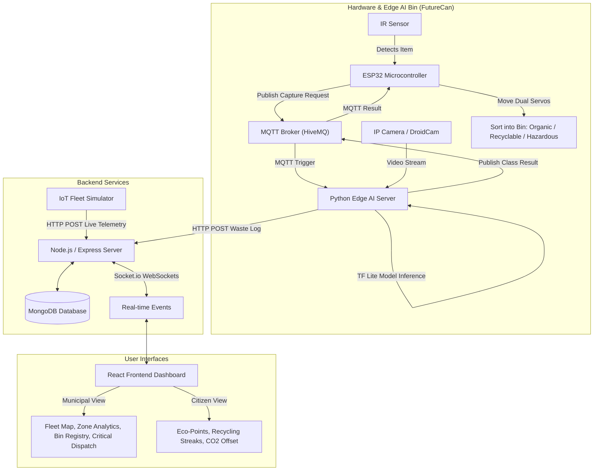

# 🚮 Smart Waste Management System (FutureCan)

> **AI-Powered Edge Waste Sorting, IoT Telemetry, & Municipal Fleet Management Platform**

[](https://reactjs.org/)
[](https://nodejs.org/)
[](https://www.mongodb.com/)
[](https://www.espressif.com/)
[](https://www.tensorflow.org/lite)
[](https://mqtt.org/)

---

## 📌 Overview

The **Smart Waste Management System (`FutureCan`)** is an end-to-end IoT and Computer Vision solution designed to automate waste segregation at source and optimize municipal waste collection routes in real-time.

Combining **Edge AI**, **Microcontroller Firmware (ESP32)**, **Real-Time WebSockets**, and a **Responsive Municipal Operations Dashboard**, the platform provides automated 3-way waste sorting (*Organic*, *Recyclable*, *Hazardous*), live bin fill-level tracking, overflow alerts, automated fleet dispatch, and citizen eco-reward gamification.

---

## 🏗️ System Architecture



---

## ✨ Key Features

### 🤖 1. Automated Edge AI Waste Classification (`FutureCan`)
- **Real-Time Computer Vision**: Uses OpenCV & TensorFlow Lite (`waste_classifier.tflite`) to classify waste items into **Organic**, **Recyclable**, or **Hazardous**.
- **Automated Dual-Servo Sorting**: ESP32 controls a slide servo and a lid servo to automatically route waste into the matching container compartment.
- **Visual & Audio Feedback**: LED lighting and buzzer notifications signal detection and classification status.

### 🗺️ 2. Municipal Operations Command Center
- **Live Fleet Map**: Interactive Leaflet map displaying real-time bin locations, fill levels, sensor statuses, and geographical ward clusters across city zones.
- **Smart Alert System**: Automated triggers for **Bin Overflow (>85%)**, **Hazardous Risk**, **Sensor Offline**, **Low Battery (<15%)**, and **Fill Rate Spikes**.
- **One-Click Fleet Dispatch**: Instantly dispatch collection vehicles to clear critical and overflowing bins.
- **Zone & Ward Analytics**: Aggregated metrics on bin density, average fill percentage, and historical fleet trends.
- **Bin Registry**: Management table for registered IoT smart bins.

### 👤 3. Citizen Eco-Rewards & Gamification
- **Recycling Leaderboard & Points**: Earn points for verified recycling activities.
- **Streak & Impact Tracking**: Track daily recycling streaks and estimated **$\text{CO}_2$ Offset**.
- **Device Controls**: Interactive controls for smart bin valves, flow rates, and status monitoring.

### 📡 4. Scalable Telemetry & Simulation Pipeline
- **Socket.io WebSockets**: Instantaneous data sync between backend server and live UI.
- **Built-in IoT Fleet Simulator**: Simulates up to 91 smart bins with dynamic fill acceleration, battery drain algorithms, and sensor fault injection.

---

## 📂 Repository Structure

```
SmartWasteManagement/
├── backend/                  # Node.js + Express API & WebSocket Server
│   ├── controllers/          # Request handlers (auth, dashboard, device, waste logs)
│   ├── middleware/           # Auth middleware (JWT verification)
│   ├── models/               # Mongoose schemas (Bin, Alert, User, WasteLog, etc.)
│   ├── routes/               # Express API routes
│   ├── .env                  # Environment variables
│   ├── server.js             # Express & Socket.io server entry point
│   └── simulateIot.js        # IoT fleet simulation script (91 smart bins)
├── frontend/                 # React 19 + Vite Frontend Application
│   ├── src/
│   │   ├── api/              # Axios API instance configuration
│   │   ├── components/       # UI Components (LiveMap, BinRegistry, ZoneAnalytics, etc.)
│   │   ├── context/          # React AuthContext state provider
│   │   └── pages/            # Application pages (Login, Signup, Dashboard)
│   ├── index.html            # Entry HTML file
│   └── vite.config.js        # Vite bundler configuration
└── hardware/                 # ESP32 Firmware & Python Edge AI Server
    ├── FutureCan/
    │   └── FutureCan.ino     # ESP32 Arduino sketch (IR sensor, Servos, MQTT)
    ├── server.py             # Python OpenCV + TensorFlow Lite MQTT AI classifier
    ├── waste_classifier.tflite # Pre-trained TFLite waste classification model
    └── requirements.txt      # Python dependencies (TensorFlow, OpenCV, Paho-MQTT)
```

---

## 🔌 Hardware Wiring & Pin Mapping

| Component | ESP32 Pin | Logic / Description |
| :--- | :--- | :--- |
| **IR Proximity Sensor** | `GPIO 21` | Digital Input (`Active-LOW` — detects item presence) |
| **Status LED Indicator** | `GPIO 4` | Digital Output (High during capture & processing) |
| **Buzzer** | `GPIO 5` | PWM Output (Audio tone on item detection) |
| **Slide Positioning Servo** | `GPIO 18` | PWM Output (Aligns chute to target bin compartment) |
| **Lid Release Servo** | `GPIO 19` | PWM Output (Opens & closes lid to drop item) |

---

## 🚀 Getting Started

### Prerequisites
- **Node.js**: v18.0.0 or higher
- **MongoDB**: Local MongoDB instance or MongoDB Atlas Connection URI
- **Python**: v3.10 or higher
- **Arduino IDE**: With ESP32 Board Support (`ESP32Servo` and `PubSubClient` libraries installed)
- **Camera Stream**: DroidCam or any IP Camera accessible over local Wi-Fi

---

### 1. Backend Setup

```bash
# Navigate to backend directory
cd backend

# Install dependencies
npm install

# Create or verify .env file
# Example .env content:
# PORT=5000
# MONGODB_URI=mongodb://localhost:27017/smartwaste
# JWT_SECRET=your_jwt_secret_key

# Start the backend server
node server.js
```
> The backend server will start on `http://localhost:5000` (or `http://localhost:5005`).

#### (Optional) Run the IoT Fleet Simulator
To generate live telemetry data for 91 simulated smart bins across city zones:
```bash
node simulateIot.js
```

---

### 2. Frontend Setup

```bash
# Navigate to frontend directory
cd frontend

# Install dependencies
npm install

# Start Vite development server
npm run dev
```
> Open your browser and navigate to `http://localhost:5173`.

---

### 3. Hardware Firmware (ESP32)

1. Open `hardware/FutureCan/FutureCan.ino` in **Arduino IDE**.
2. Install required libraries via Library Manager:
   - `ESP32Servo`
   - `PubSubClient`
3. Update Wi-Fi network credentials:
   ```cpp
   const char* ssid     = "YOUR_WIFI_SSID";
   const char* password = "YOUR_WIFI_PASSWORD";
   ```
4. Select board **ESP32 Dev Module** and click **Upload**.

---

### 4. Python Edge AI Classifier Server

```bash
# Navigate to hardware directory
cd hardware

# Create and activate virtual environment
python -m venv venv
# On Windows:
venv\Scripts\activate
# On Linux/macOS:
source venv/bin/activate

# Install dependencies
pip install -r requirements.txt

# Configure IP Camera URL & backend API in server.py, then launch:
python server.py
```

---

## 📡 MQTT Topics & API Endpoints

### MQTT Messaging (`broker.hivemq.com:1883`)
| Topic | Direction | Payload Example | Description |
| :--- | :--- | :--- | :--- |
| `futurecan/capture_request` | ESP32 $\rightarrow$ Python | `{"request":"capture","binId":"DEMO-888"}` | Triggered when IR sensor detects item |
| `futurecan/waste_class` | Python $\rightarrow$ ESP32 | `{"primary_category":"Organic","item_name":95.5}` | Result published by AI classifier |

### Key REST API Routes
- `POST /api/auth/signup` - Register new user / municipal admin account
- `POST /api/auth/login` - Authenticate and receive JWT token
- `GET /api/dashboard/municipal` - Fetch municipal metrics, fleet status & trends
- `POST /api/dashboard/iot-update` - Receive live telemetry updates from IoT smart bins
- `POST /api/dashboard/waste-log` - Log AI waste classification results from Python server
- `POST /api/dashboard/dispatch` - Clear critical alerts and dispatch collection fleet
- `GET /api/dashboard/live-map` - Get live bin locations & active alerts for Leaflet map

---

## 📜 License

This project is proprietary and not licensed for reuse or distribution without permission.

---

## 👤 Author

Developed by **[Urvi Gupta](https://github.com/UrviGupta8124)**  
*Smart Waste Management Platform for Sustainable Cities & Urban Automation.*
